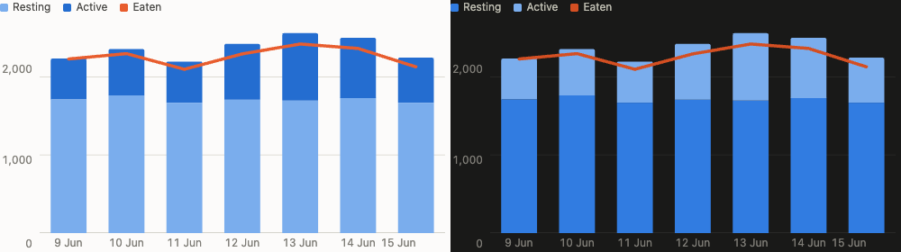
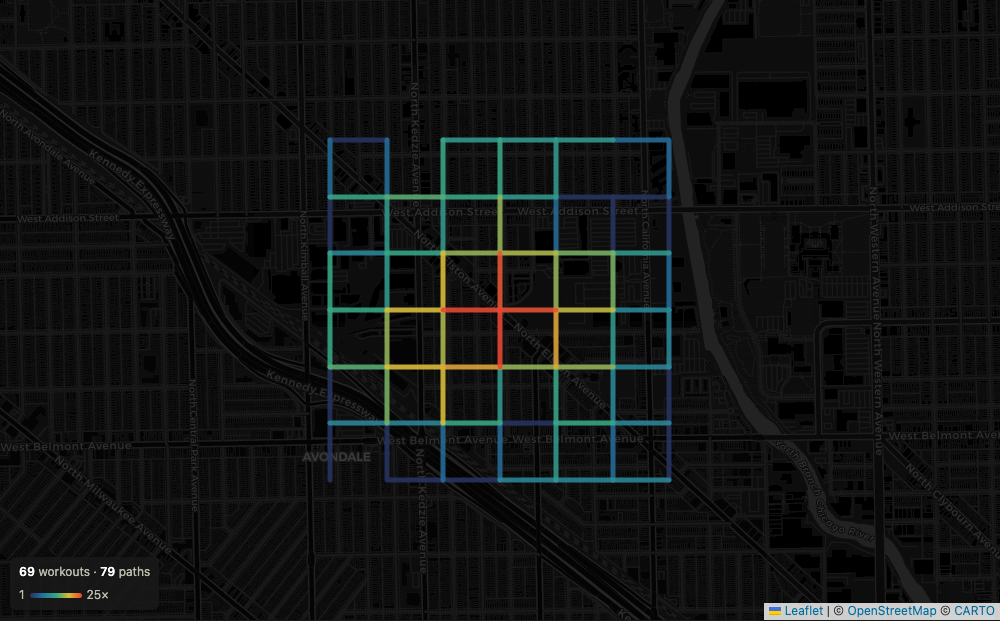
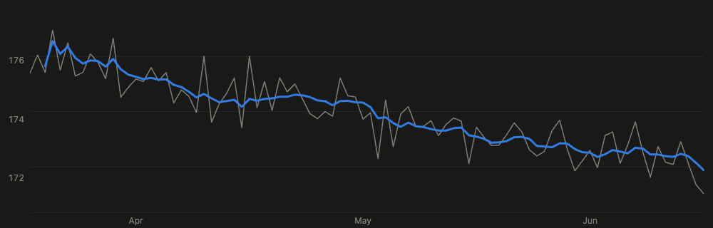
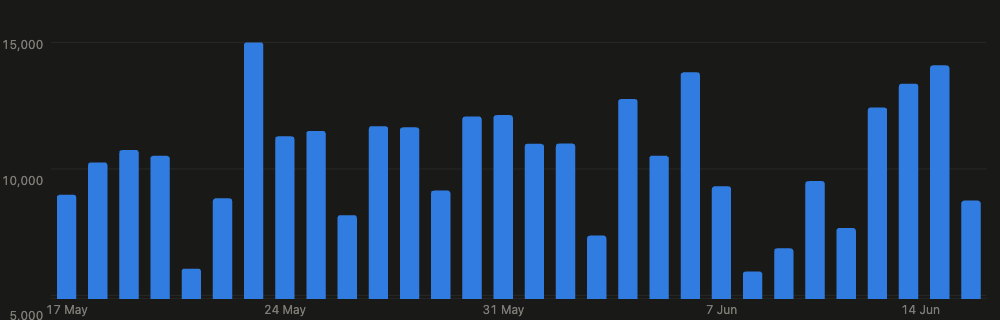
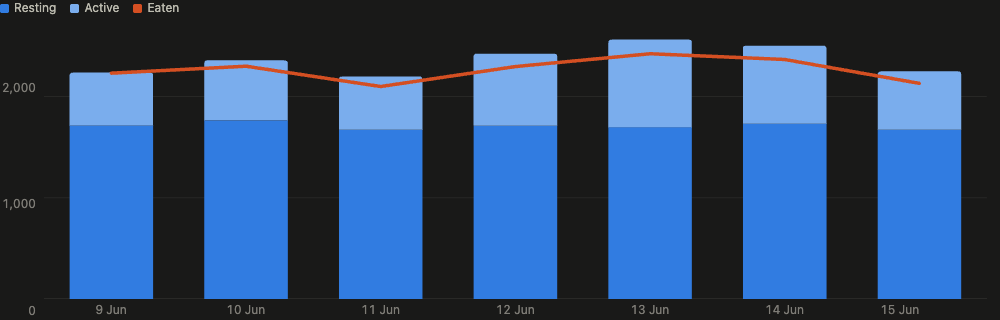
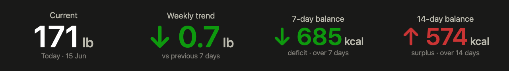

# Rendered pages

Every screenshot below is synthetic — generated by
[`scripts/demo_data.py`](../scripts/demo_data.py), which seeds an instance with
invented data from a fixed seed. Nothing here is anyone's real health record, and
the coverage map is a lattice of made-up walks over Chicago's street grid.

`/v1/render/…` serves self-contained HTML pages built from the same JSON the
[data endpoints](api.md) return — designed for a Home Assistant **Webpage
(`iframe`) card**, but usable anywhere a URL can be embedded.

They accept a bearer token **or** an `embed_token`, the derived read-only
credential from `GET /v1/embed-token`.

## Options common to every render endpoint

These mean the same thing on `/v1/render/map`, `/v1/render/chart` and `/v1/render/stat`, and on any render endpoint added later — they are declared once as a FastAPI dependency rather than copied per endpoint.

| Parameter | Default | Description |
|---|---|---|
| `title` | derived per endpoint | Document title. Also names the chart for a screen reader. |
| `refresh_minutes` | `30` | How often the page reloads itself, 1–1440. |
| `margin` | `0` | Padding round the contents, as a **percent of the frame**, 0–20. |
| `theme` | `auto` | `auto`, `light` or `dark`. Overrides the viewer's setting. |
| `embed_token` | — | Read-only token; a bearer token works too. |

`margin` is a percentage rather than pixels because these pages embed anywhere from ~240px to ~1100px wide, and a fixed inset would swallow a small card and vanish in a large one. It is *additive*: `0` renders exactly as if the parameter were absent. Percentage padding resolves against the width on all four sides, so one number gives a visually even inset. A page that sizes its own type to the frame — the stat tile does — measures the padded box, so raising the margin shrinks the text to match rather than pushing it out.

`theme` stamps `data-theme` on `<html>`. That is what the palette keys its light/dark overrides on, and what the map consults before falling back to `prefers-color-scheme`, so an override moves the basemap tiles as well as the page. Left at `auto` nothing is stamped and every page follows the viewer, which is the usual case.



A second, smaller group — `date_range`, `start_date`, `end_date` — is shared by the endpoints that plot a span, which is the map and the chart. The stat tile scopes itself with `window` instead.

## Coverage map



Colour carries how many times each stretch was walked — warm where the routes overlap most, which is nearest home. `GET /v1/render/map` returns the same coverage as a self-contained Leaflet page — built for a Home Assistant **Webpage (`iframe`) card**, but usable in any dashboard that embeds a URL. It accepts every parameter the GeoJSON endpoint does, so the URL is the tuning surface, plus:

| Parameter | Default | Description |
|---|---|---|
| `interactive` | `false` | Panning, zooming and per-path tooltips. Off by default — see below. |
| `zoom_control` | `false` | Show Leaflet's `+`/`−` buttons. Independent of `interactive`. |
| `attribution` | `true` | Show the map credit. See the note below before turning this off. |
| `weight` | unset | Pin every line to this stroke width (0–20). Unset, width scales with traversal count; set, frequency is carried by colour alone. |

### Load shedding and caching

Coverage rendering is pure Python and therefore GIL-bound, so concurrent requests are much *slower* than sequential ones — measured on a 4 km box, eight requests took 1.96 s one after another and 70.9 s all at once, burning 208 s of CPU for ~2 s of work. This matters because editing a dashboard card's URL fires one request per keystroke.

Two mechanisms handle that:

- **Requests are serialised.** One coverage render runs at a time. Beyond a queue depth of 10 the API returns **`429 Too Many Requests`** with a `Retry-After` header rather than letting the pile-up grow.
- **Results are cached** for `HEALTH_EXPORT_CACHE_TTL` seconds (default `300`, set `0` to disable). The key is the *filters* — `lat`, `lon`, `width`, `height`, dates, `workout_type`, `max_vertices`, `tolerance_m`, `min_count` — and deliberately not the presentation options, so re-rendering the same area with a different `weight` or without the zoom control is instant. The cache is checked before queueing, so a repeat never waits behind a running render, and again after acquiring the turn, so a burst of identical requests computes once.

**Ingesting an export drops the whole cache**, so new data appears on the next request rather than waiting out the TTL. Without that the cache is only time-bounded, and a reading can sit in the store for five minutes while the rendered tiles still serve the figures from before it — `/v1/health/summary` current, the dashboard behind, and nothing on the page to say which you are looking at. Everything goes, not just the summaries: an export can carry workouts, and those move the map.

The TTL still matters for the burst it was added for — changing a URL in a Home Assistant card re-requests on every keystroke, and those repeats hit the cache.

**Interactivity is off by default.** A dashboard tile is something you glance at, not something you drive, and a map that captures the scroll wheel is actively hostile inside a scrolling dashboard. `interactive=false` disables dragging, wheel/double-click/pinch/box zoom, keyboard navigation, and the per-path tooltips. Set `interactive=true` to get all of it back.

It is independent of `zoom_control`: buttons on with interactivity off is a usable "look closer, but stay put" combination. Turning interactivity off also skips binding a tooltip and pointer handlers to every path, which is not free when a fine `tolerance_m` produces thousands of them.

> **Attribution.** OpenStreetMap and CARTO both require credit for their data and tiles, so `attribution` defaults to on and hiding it is a deliberate choice for you to make. The credit remains in an HTML comment in the page source either way, but that is not a substitute for displaying it on a map you publish.

The GeoJSON is embedded in the document rather than fetched, so the page is a single request. Leaflet is served same-origin from `/static`; the only outbound dependency is the CARTO basemap tiles (OpenStreetMap data). Lines are coloured and weighted by traversal `count` on a log scale, and the view fits the routes rather than the query box — the box is a filter and is usually much larger than the area actually walked.

**Authentication.** An iframe cannot send an `Authorization` header, so the map page also accepts a token in the query string. That token is *not* `HEALTH_EXPORT_API_TOKEN` — putting the real token in a dashboard config and browser history would expose ingestion rights. Instead a second, read-only token is derived at startup:

```
embed_token = HMAC-SHA256(HEALTH_EXPORT_API_TOKEN, "embed")[:32]
```

It cannot be reversed to the API token, leaking it exposes the coverage map and nothing else, and rotating the API token rotates it too. Fetch it once with the real bearer token:

```sh
curl -H "Authorization: Bearer $TOKEN" https://your-host/v1/embed-token
```

Then embed:

```yaml
type: iframe
url: https://your-host/v1/render/map?lat=52.52&lon=13.40&width=4000&height=4000&min_count=3&embed_token=…
aspect_ratio: 100%
```

Every other endpoint still requires the real bearer token; `embed_token` unlocks only the embeddable pages (`/v1/render/map` and `/v1/render/chart`).


## Metric chart

`GET /v1/render/chart` renders a metric's daily series as a line or bar chart — the companion to the map card, for embedding the same way.



| Parameter | Default | Description |
|---|---|---|
| `metric` | required | e.g. `weight_body_mass`. See `/v1/health/metrics`. **Repeatable** — see below. |
| `label` | derived from `metric` | Series name in the tooltip. Repeatable, one per `metric`, in order. |
| `unit` | the stored unit | Override the unit shown in the tooltip. Repeatable; empty (`unit=`) drops it. |
| `window` | `7` | Rolling-trend window in days. `0` draws the readings only. |
| `kind` | `line` | `line` or `bar`, for every panel in the chart. See below. |
| `stack` | unset | Names the stack a metric belongs to. Repeatable, one per `metric`. See below. |
| `layout` | `grouped` | `grouped` or `overlay` — how stacks are arranged. |
| `legend` | auto | Show the key. On by default only when a panel holds several series. |
| `baseline` | unset | Pins the y-axis floor. Unset, the axis zooms to the data (but see stacks). |

`metric` is repeatable, and each one becomes its own **stacked panel** with its own y-axis, sharing one x-axis and one hover crosshair. Measures of different scale never share a y-scale here: a dual axis can be slid until either series appears to lead, asserting a relationship the data does not have. Steps (~10,000 `count`) and walking distance (~6 `mi`) differ by a factor of ~1,800 — two panels state each on its own terms.

Values are comma-grouped and lose their decimal above 1,000, so a five-digit step count reads `9,611` rather than `9611.39`. Below that the decimal stays (`191.4 lb`), and sub-unit metrics keep enough digits to survive.

Metrics stored in `count` or `kcal` are reported **whole at any magnitude** — a tally has no fractional part, and nobody quotes a 756.3 calorie deficit. Distance keeps its decimal, because 6.4 mi and 6 mi are different claims.

`unit=` with no value exists because some stored units are noise: `step_count`'s unit is the literal string `count`, which adds nothing beside the number.

The trend is a **rolling least-squares fit**, not a moving average: at each day with a reading, a straight line is fitted through the readings in the trailing window and evaluated at that day. It follows the local slope rather than averaging it away, so it turns with the data instead of lagging half a window behind it.

The window is **calendar days**, not a count of points: readings are near-daily but not every day, and a point-count window would silently stretch across a gap and fit over a longer period than advertised. The fit needs **at least three readings** in the window — least squares through two points is just the segment joining them, which would draw the trend on top of the raw line and say nothing.

The daily line **breaks when consecutive readings are more than 3 days apart**, so a hiatus shows as a gap rather than a straight line drawn through days that were never measured.

### Line or bar

`kind` picks the mark, and the right answer follows from what the number is:

- **`line`** for a *sampled level* — body weight is a continuous quantity you happen to read on some mornings, so the value between two readings is meaningful and a line may span it.
- **`bar`** for a *discrete daily total* — a step count has no value between Tuesday and Wednesday for a line to interpolate to, and the rolling trend answers a question nobody asks of a step counter. Bars get no trend line; pass `window=0`.



A bar chart uses a band x-scale, giving each day a slot and centring its bar in it, so the first and last bars sit fully inside the frame. Hovering highlights the bar rather than drawing a crosshair through it.

### Several series on one axis



`stack` is repeatable alongside `metric` and names the stack each one belongs to. Supplying it changes the shape of the chart: every metric moves into **one panel on one shared y-axis**, and metrics naming the same stack are drawn as segments of a single bar.

Sharing an axis is only honest when the measures share a unit — that is the caller's assertion, and it is exactly what grouping them means. Steps and miles must stay in separate panels (omit `stack`); resting energy, active energy and dietary energy are all kcal, so they belong together.

`layout` arranges the stacks:

- **`grouped`** — one bar per stack, side by side inside the day's slot. Best for a direct comparison: burn against intake reads as the height gap between two bars.
- **`overlay`** — the first stack draws as bars, later stacks as lines over them. Better for following one series' trend across the window.

`legend` follows: a key appears above the plot when a panel holds more than one series, because nothing else says which fill is which. Single-metric and multi-panel cards stay bare as before. `legend=false` turns it off.

The fills come from the `dataviz` reference palette, checked with its validator in both modes. Slots 1 and 2 are two steps of one hue and slot 3 contrasts with them, which suits parts-of-a-whole beside a separate measure — resting and active energy are components of burn, so relating them by hue says something true, while intake is a different quantity. That one-hue pair has to be validated as an **ordinal ramp** rather than as categorical slots: the categorical check asks whether two independent series can be told apart and fails the pair at ΔE 9.5 against a floor of 15, which is the wrong question for two halves of one bar.

Bars are drawn as paths rather than rects so the **data end can be rounded while the joins stay square**. A rect rounds all four corners or none, and inside a stack two rounded edges meeting pinch the join, breaking the column into pieces. Only the segment that caps a stack gets the corners.

**Stacks start at zero unless you say otherwise.** A stacked bar claims its segments sum to its height; cut the axis off above zero and only the bottom segment is foreshortened, so the split between the parts misstates their ratio — 2,123 resting against 1,072 active reads as 1.5:1 rather than 2:1. Zoom-to-data is the right default for one series and the wrong one here, so `baseline` defaults to `0` for a stacked chart. Pass it explicitly to override.

### The y axis

**Zoomed to the data by default, for both marks.** Body weight moves a few pounds around ~190, and a zero baseline would flatten every real movement; the same is true of a step count that never goes near zero.

`baseline` pins the floor when you want one. This matters more for bars than lines, so it is worth stating plainly: **with a zoomed axis, bar lengths are not proportional to their values.** A 14,844 bar can look several times a 7,600 bar when it is under twice. What a zoomed bar chart reads well is *day-to-day variation*, which is the question a 30-day step card is actually asked, and the exact figures are one hover away. Pass `baseline=0` for the proportional version.

```yaml
type: iframe
url: https://your-host/v1/render/chart?metric=weight_body_mass&date_range=last+90+days&window=7&embed_token=…
grid_options: {columns: full, rows: 6}
```

A daily-total bar card:

```yaml
type: iframe
url: https://your-host/v1/render/chart?metric=step_count&unit=&title=Steps&kind=bar&window=0&date_range=last+30+days&embed_token=…
grid_options: {columns: full, rows: 5}
```

Three series on one axis — two stacked as burn, one beside it as intake:

```yaml
type: iframe
url: https://your-host/v1/render/chart?metric=basal_energy_burned&stack=burn&label=Resting&unit=kcal&metric=active_energy&stack=burn&label=Active&unit=kcal&metric=dietary_energy&stack=eaten&label=Eaten&unit=kcal&kind=bar&window=0&date_range=last+7+days&title=Diet&embed_token=…
grid_options: {columns: 24, rows: 5}
```

Two metrics stacked in one card, a panel each:

```yaml
type: iframe
url: https://your-host/v1/render/chart?metric=step_count&unit=&label=Steps&metric=walking_running_distance&unit=mi&label=Distance&date_range=last+30+days&window=7&embed_token=…
grid_options: {columns: full, rows: 6}
```

## Stat tile

`GET /v1/render/stat` renders one number — for the questions that are a figure rather than a plot.



Colour appears only where a direction has been declared good, and the balance tile is the one card that colours both ways — the same tile over seven days and fourteen, landing on a deficit and a surplus.

| Parameter | Default | Description |
|---|---|---|
| `metric` | required | e.g. `weight_body_mass` |
| `stat` | `latest` | `latest` (most recent reading), `change` (week over week), or `balance` |
| `minus` | — | Metrics to subtract, for `balance`. Repeatable. |
| `window` | `7` | Days per half, for `change`; days in the window, for `balance` |
| `label` | `Current` / `Weekly trend` | Tile label, sentence case |
| `unit` | the stored unit | Override the unit beside the number. Empty (`unit=`) drops it. |
| `good_direction` | `none` | `up`, `down`, or `none` — see below |
| `align` | `left` | `left`, `center`, or `right`. |

### Today counts as zero, for totals only

A **summed** metric with nothing recorded today reads as `0`, dated today, rather than falling back to the last day that has data. The day is in progress: nothing logged means nothing has happened yet, which is a number. This applies to the stat tile, the balance window and the chart alike, so all three tell the same story — the diet chart draws today's intake at zero, and the balance counts today's partial burn against it.

**Averaged** metrics are untouched: you do not weigh nothing because you skipped the scale, so the weight tile still shows its last reading and says how stale it is. The distinction is drawn from the metric's own aggregation, not from a flag.

The trade is worth knowing: if data stops arriving, a summed tile reads `0` rather than showing a stale figure labelled "Yesterday". The note line still says "Today", so it is not hidden, but a feed outage and a genuinely empty day look alike.

`change` compares **two adjacent windows of equal length in calendar days** — `[t-6, t]` against `[t-13, t-7]` at the default. Equal spans matter: unequal ones weight the two means differently and bias the comparison. It renders an empty state rather than a number when either window has no readings.

`balance` subtracts every `minus` metric from `metric` across the window — energy in against energy out. Negative renders green as a deficit, positive red as a surplus. This is the one tile that colours both directions: the change tile stays neutral because whether a metric rising is good depends on the goal, but here the goal *is* what's being measured. Colour is still never the only channel — the note says "deficit" or "surplus" and the arrow carries direction.

**Days with no `metric` reading are left out of the window** — except today, see below — and the note says how many days remain. A finished day with nothing logged is missing data, not a day of fasting, and it happens: two days in the last sixty have burn recorded and no intake, against a lowest genuinely-logged day of 1,317 kcal. Scoring those as zero would invent a 2,200 kcal deficit each.

`good_direction` colours the delta, and defaults to `none` because whether a metric rising is good is a property of your goal, not of the metric — for weight it depends entirely on what you're trying to do. The sign and an arrow carry direction regardless, so colour is never the only channel.

Numbers follow the same rule as the chart: grouped and whole above 1,000 (`9,611`), one decimal below (`191.4`). On a summed metric — steps, distance, energy — `latest` is *the latest day's total*, so it reads as "today" and degrades to the last day with data if none has arrived yet.

```yaml
type: iframe
url: https://your-host/v1/render/stat?metric=weight_body_mass&stat=change&good_direction=down&embed_token=…
grid_options: {columns: 4, rows: 3}
```

> ⚠️ **Hevy double-count warning:** Hevy writes completed workouts back to HealthKit as `Traditional Strength Training`. Apple Health metrics like `active_energy` and `apple_exercise_time` already include those sessions. Do not add Apple Health exercise totals to Hevy session totals — they overlap. Use the Hevy MCP tools for structured strength-session detail.

---

[← Documentation index](../README.md#documentation)
